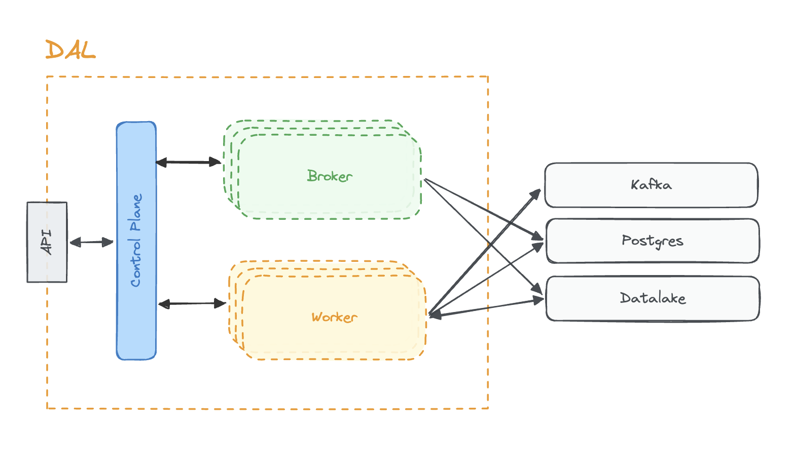
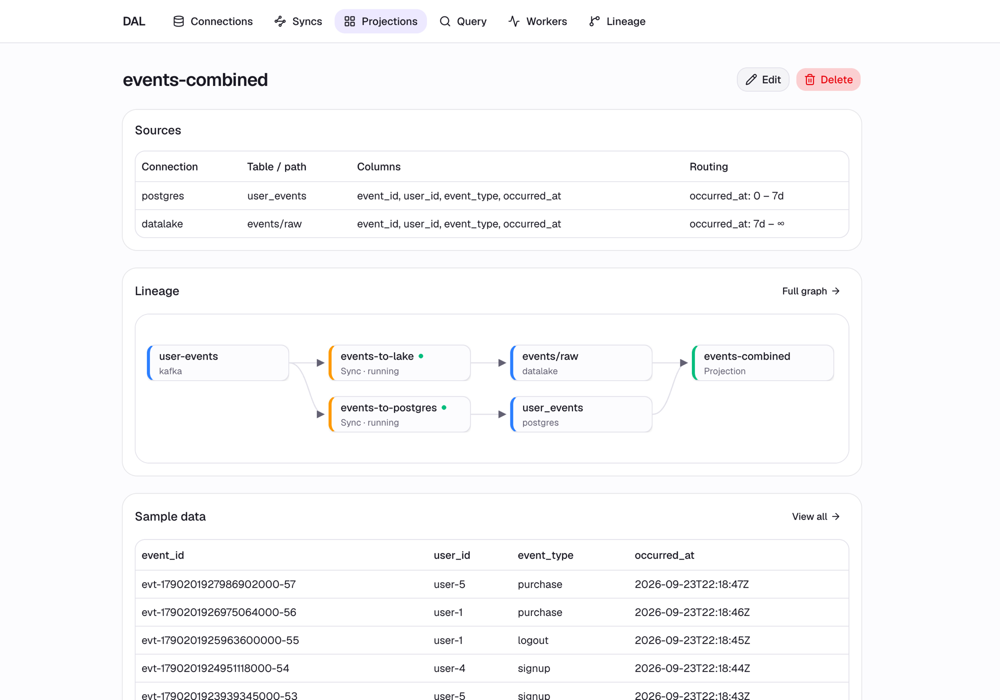

# DAL — Data Abstraction Layer

The **Data Abstraction Layer (DAL)** decouples data consumers from underlying physical storage, enabling organizations to seamlessly move, synchronize, and optimize data locations across different sources without breaking downstream applications.

By routing data from source systems (e.g., Kafka) into query-optimized stores (e.g., Postgres, data lakes), DAL serves reads back through a stable, unified query interface. This ensures that callers never need to know which physical store or technology is actually answering a given query.

**Key Benefits:**
- **Stable Interface:** Downstream applications are insulated from infrastructure migrations or underlying database changes.
- **Data Mobility:** Create cross-source projections and optimize data storage locations transparently.
- **Declarative Operations:** Resources (`Connection`, `Sync`, `Projection`) are defined as YAML and applied to a control plane, which orchestrates per-Sync workers on Kubernetes to manage data movement.



## Components

| Component | Responsibility |
|---|---|
| `controlplane` | Source of truth for resources; validates and stores them; orchestrates per-Sync workers on Kubernetes |
| `workerd` | Rust binary, one process per `Sync`; moves data from a source connection to a target connection — kafka→postgres, kafka→lake, or lake→postgres (streaming or scheduled) |
| `broker` | Serves queries against named `Projection`s, resolving the current physical store/table via the control plane |
| `web` | UI for authoring resources and running queries |
| `core` | Shared Go library: resource types, validation, gRPC contracts |
| `tools/producer` | Standalone synthetic Kafka event generator for local dev |

## Run Local

Requires a Kubernetes cluster (this repo targets Rancher Desktop's built-in cluster, context `rancher-desktop`).

```
make build              # build the latest images (controlplane, broker, workerd, web)
make up                 # deploy manifests to Kubernetes (images must already exist — run make build first)
make apply-tiered-seed  # apply the tiered-events example and seed historical data into the lake
make run-producer       # generate synthetic Kafka events; pass flags via ARGS, e.g. ARGS="--topic=user-events --interval=500ms"
make logs               # tail logs from every DAL-managed pod
make down               # tear the stack down, including per-Sync worker pods (add ARGS=--all to also drop PVC-stored data)
```

A typical first run is `make build && make up && make apply-tiered-seed`. `apply-tiered-seed` applies [`examples/tiered-events`](examples/tiered-events) and publishes both recent and backdated events so Postgres (7-day retention) and the lake (full history) end up visibly different — right after it finishes you can open `web` (`http://localhost:30300`) and query the `events-recent`, `events-history`, and `events-combined` projections to see the tiered postgres/lake storage feature in action.

A `Projection` can span multiple sources with per-source time-range routing, so a single query transparently reads recent rows from Postgres and older rows from the lake:


